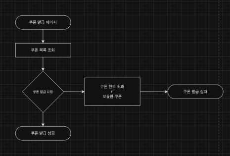

# 프로젝트 선정
`e-commerce` 를 선정 하였습니다. 

## Milestone
 
- 진행 가능 한 날 : 월,화,수,목,일 ( 주 5일 )
- 1MD : 1일 ( 3시간 )

### 설계 문서 작성 (3MD)
- 요구 사항 분석
- UML 
  - 시퀀스 다이어그램
  - 플로우 차트
  - ERD
- 도메인 객체 설계

### API 명세 작성 (2MD)
- API 명세 작성
- Mock 개발
- 패키지 주고 설계

### 구현 (5MD)
- 개발 환경 구성
- Test 코드 작성
- 요구사항 API 개발

## [요구사항 분석](https://docs.google.com/spreadsheets/d/1t_x48OX8v5qGE9aPk9-a_7EixDlwSdpn_QKgB-MDL4c/edit?usp=sharing)

## 시퀀스 다이어그램

### 포인트 충전/조회
  

### 상품 조회
  

### 선착순 쿠폰 발급
  

### 주문/결재
  

## 플로우 차트
### 포인트 충전/조회
  

### 선착순 쿠폰 발급
  

### 주문/결재
  

## ERD 설계

## API 명세

## 패키지 구조

## 서버 Configuration