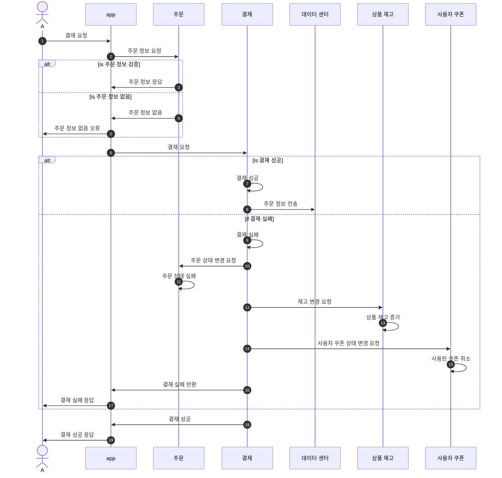

```mermaid
sequenceDiagram
    autonumber
    actor A
    participant app
    participant B as 주문
    participant C as 결재
    participant D as 데이터 센터
    participant E as 상품 재고
    participant F as 사용자 쿠폰
    A ->> app: 결재 요청
    app ->> B: 주문 정보 요청
    alt is 주문 정보 검증
        B ->> app: 주문 정보 응답
    else is 주문 정보 없음
        B ->> app: 주문 정보 없음
        app ->> A: 주문 정보 없음 오류
    end

    app ->> C: 결재 요청
    alt is 결재 성공
        C ->> C: 결재 성공
        C ->> D: 주문 정보 전송
    else if 결재 실패
        C ->> C: 결재 실패
        C ->> B: 주문 상태 변경 요청
        B ->> B: 주문 상태 실패
        C ->> E: 재고 변경 요청
        E ->> E: 상품 재고 증가
        C ->> F: 사용자 쿠폰 상태 변경 요청
        F ->> F: 사용된 쿠폰 취소
        C ->> app: 결재 실패 반환
        app ->> A: 결재 실패 응답
    end
    C ->> app: 결재 성공
    app ->> A: 결재 성공 응답


```