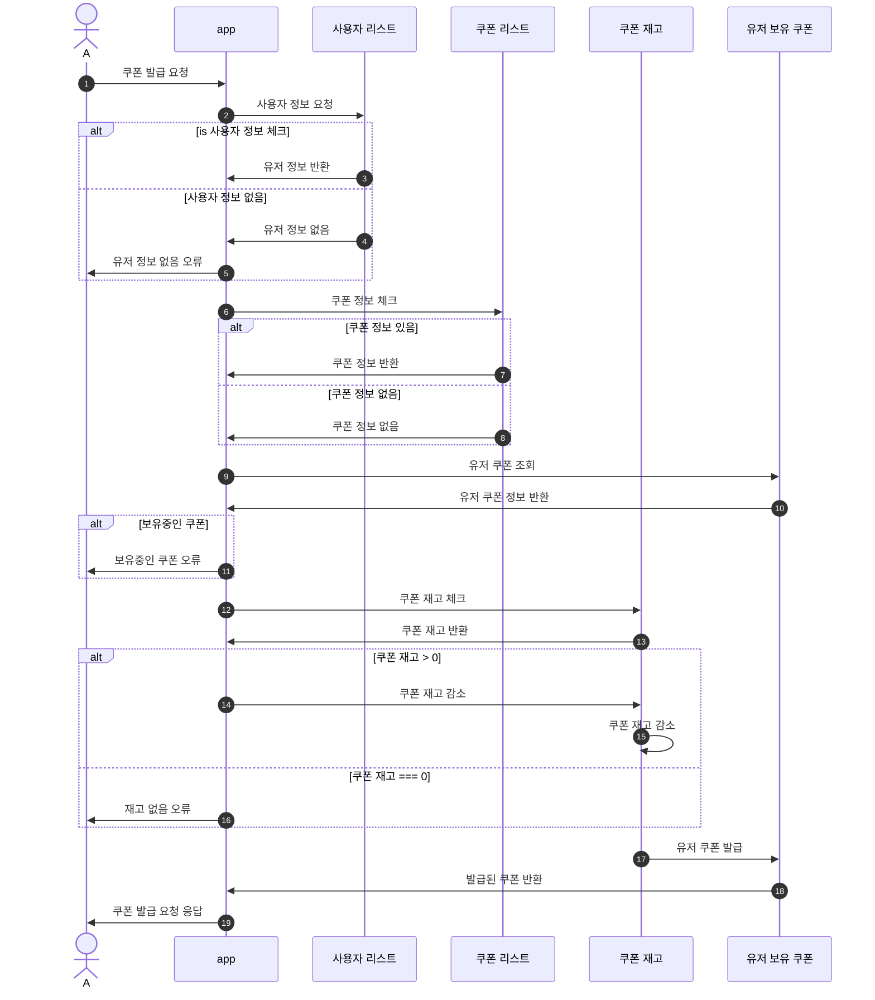

```mermaid
sequenceDiagram
autonumber
actor A
participant app
participant B as 사용자 리스트
participant C as 쿠폰 리스트
participant D as 쿠폰 재고
participant E as 유저 보유 쿠폰
A->>app: 쿠폰 발급 요청
app->>B: 사용자 정보 요청

    alt is 사용자 정보 체크
        B->>app: 유저 정보 반환
    else 사용자 정보 없음
        B->>app: 유저 정보 없음
        app->>A: 유저 정보 없음 오류
    end

    app->>C: 쿠폰 정보 체크
    alt 쿠폰 정보 있음 
        C->> app: 쿠폰 정보 반환
    else 쿠폰 정보 없음
        C->> app: 쿠폰 정보 없음
    end

    app->>E: 유저 쿠폰 조회
    E->> app: 유저 쿠폰 정보 반환
    alt 보유중인 쿠폰
        app ->> A: 보유중인 쿠폰 오류
    end

    app ->> D: 쿠폰 재고 체크
    D->> app : 쿠폰 재고 반환

    alt 쿠폰 재고 > 0 
        app ->> D: 쿠폰 재고 감소 
        D ->> D: 쿠폰 재고 감소
    else 쿠폰 재고 === 0 
        app ->> A: 재고 없음 오류
    end

    D ->> E: 유저 쿠폰 발급
    E ->> app: 발급된 쿠폰 반환
    app ->> A: 쿠폰 발급 요청 응답
```