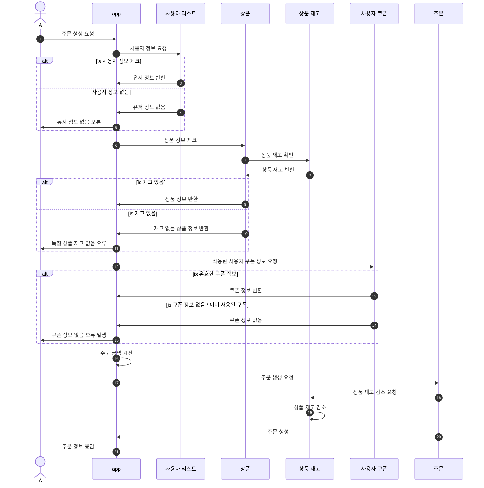

```mermaid
sequenceDiagram
    autonumber
    actor A
    participant app
    participant B as 사용자 리스트
    participant C as 상품
    participant D as 상품 재고
    participant E as 사용자 쿠폰
    participant F as 주문
    A ->> app: 주문 생성 요청
    app ->> B: 사용자 정보 요청
    alt is 사용자 정보 체크
        B ->> app: 유저 정보 반환
    else 사용자 정보 없음
        B ->> app: 유저 정보 없음
        app ->> A: 유저 정보 없음 오류
    end

    app ->> C: 상품 정보 체크
    C ->> D: 상품 재고 확인
    D ->> C: 상품 재고 반환

    alt is 재고 있음
        C ->> app: 상품 정보 반환
    else is 재고 없음
        C ->> app: 재고 없는 상품 정보 반환
        app ->> A: 특정 상품 재고 없음 오류
    end

    app ->> E: 적용된 사용자 쿠폰 정보 요청
    alt is 유효한 쿠폰 정보
        E ->> app: 쿠폰 정보 반환
    else is 쿠폰 정보 없음 / 이미 사용된 쿠폰
        E ->> app: 쿠폰 정보 없음
        app ->> A: 쿠폰 정보 없음 오류 발생
    end
    app ->> app: 주문 금액 계산
    app ->> F: 주문 생성 요청
    F ->> D: 상품 재고 감소 요청
    D ->> D: 상품 재고 감소
    F ->> app: 주문 생성
    app -> A: 주문 정보 응답
```