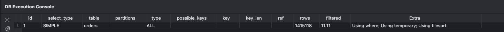
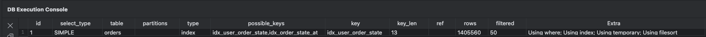
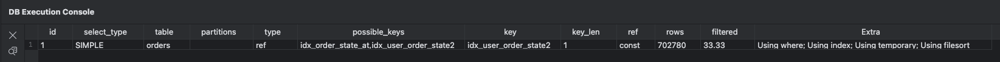
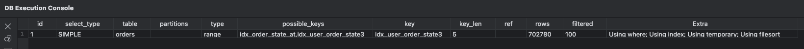

# 이커머스 시나리오의 SQL 성능 개선

- 나의 시나리오에서 수행하는 쿼리들을 수집해보고, 필요하다고 판단되는 인덱스를 추가하고 쿼리의 성능개선 정도를 작성
- 현재 프로젝트의 SQL 쿼리를 수집, 분석 하면 좋겠지만 SQL이 대부분 간단? 하기 때문에 임의의 시나리오를 만들어서 진행

## 1.이커머스의 부하가 존재하는 시나리오 생성

- 사용자의 특정 기간의 구매 내역을 조회하는 쿼리
- 통계 테이터 추출을 위해 특정 기간동안 구매 완료된 주문 목록을 조회하는 쿼리

## 2. SQL 성능 개선 방법

- 적절한 인덱스 활용: 쿼리 성능 최적화를 위해 필요한 인덱스를 추가
- 정규화 및 비정규화의 균형 유지: 데이터 모델링을 최적화하여 JOIN을 최소화
- 쿼리 최적화: WHERE 절, JOIN 순서, 서브쿼리 대신 조인 활용 등
- 캐싱 사용: Redis, Memcached와 같은 캐시 시스템 활용
- 파티셔닝 및 샤딩: 대량 데이터베이스에서 로드 분산

## 3. 인덱스(Index)란?

- 인덱스(Index) 는 데이터베이스에서 검색 성능을 최적화하기 위해 사용되는 자료구조
- 도서관의 색인(Index)처럼, 데이터베이스에서 특정 데이터를 빠르게 찾기 위해 사용

### 클러스터 인덱스

- InnoDB는 프라이머리 키(Primary Key) 를 클러스터 인덱스로 사용
- 테이블의 실제 데이터가 클러스터 인덱스에 저장됨
- 기본 키를 기준으로 데이터가 물리적으로 정렬됨
- 예시: PRIMARY KEY => PK가 없다면 유니크 인덱스 중 첫번쨰가 클러스터 인덱스가 된다

### 비 클러스터 인덱스

- 보조 인덱스에는 기본 키의 값이 저장되며, 기본 키를 통해 데이터를 찾아야 함 (추가적인 디스크 접근 필요)
- 구조: 보조 인덱스 -> 기본 키 값 -> 실제 데이터
    - 인덱스에는 데이터의 위치(주소)가 저장
- 예시: INDEX, UNIQUE INDEX

## 3. 인덱스의 장단점

### 장점

- 검색 속도 향상: WHERE, ORDER BY, GROUP BY를 사용할 때 성능 최적화
- JOIN 성능 개선: 인덱스를 사용하면 조인 시 테이블 검색 범위를 최소화
- 빠른 데이터 접근: 특정 컬럼에 대한 빠른 조회 제공

### 단점

- INSERT / UPDATE / DELETE 성능 저하
    - 인덱스를 갱신하는 시간이 추가로 소요됨.
- 디스크 공간 추가 사용
    - 인덱스는 추가적인 저장 공간을 필요로 함.
- 과도한 인덱스는 오히려 성능 저하
    - 너무 많은 인덱스는 쿼리 최적화보다 오버헤드를 증가시

---

## 4. 성능 개선 예시

- 특정 기간 동안(1년) 사용자들의 주문 목록을 조회 ( 주문 횟수 순으로 내림차순 정렬 )

```sql
# 사용 테이블
CREATE TABLE orders (
  order_id BIGINT PRIMARY KEY AUTO_INCREMENT,
  user_id BIGINT NOT NULL,
  user_coupon_id BIGINT,
  order_state ENUM('PENDING', 'COMPLETED', 'FAILED') NOT NULL DEFAULT 'PENDING',
  order_at TIMESTAMP NOT NULL DEFAULT CURRENT_TIMESTAMP
);

# 조회 SQL
select user_id, count(*) as order_count
from orders
where order_state = 'COMPLETED'
and order_at >= '2024-01-01'
group by user_id
order by order_count desc;
```

- AS-IS: 인덱스 없이 조회 시, Full Table Scan으로 인한 성능 저하 발생
  
- TO-BE: user_id, order_at, order_state 컬럼에 인덱스 추가
- 인덱스 추가 후 성능 개선
  

### 결과 분석

- 모든 테이블을 조회 했음으로 테이블 풀스캔 -> 인덱스 풀 스캔 으로 변경 되었음 ( 인덱스를 사용 했다는 의미 )
    - 하지만 인덱스와 테이블 모두 풀 스캔했다는 점에서 성능저하는 크지 않음
    - 같은 맥락으로 rows(두개의 DB가 서로 row가 조금 다름..)조회수가 동일
    - 성능 개선 했다고 볼 수 없음
- 인덱스를 조금더 효율적으로 변경한다면?

### 추가 개선 1

- `order_state, user_id, order_at` 컬럼을 인덱스로 생성
- 인덱스 추가 후 성능 개선
  

### 결과 분석 1

- 이전 실행 계획과 비교 하였을 때 인덱스 풀 스캔에서 ref 타입으로 변경
    - 특정 값을 기준으로 인덱스를 사용하여 데이터를 필터링
- 이전보다 rows 조회수가 줄어듬
    - 이전에는 140만건 -> 70만건
- filtered 값이 50 -> 33.33으로 변경
- 전체적으로 조회 속도가 개선 된다고 볼 수 있고 인덱스의 순서에 따라 DB의 성능이 달라 질 수 있음
-

### 상태 날짜 사용자 순으로 인덱스를 적용한다면?

- `order_state, order_at, user_id` 컬럼을 인덱스로 생성
- 인덱스 추가 후 성능 개선
  

### 결과 분석 2

- 이전 실행 계획과 비교 하였을 때 인덱스 ref에서 range 타입으로 변경
- filtered 값이 33.33 -> 100%로 변경
- 실제로 조회하는 데이터수는 동일 하지만 사용자별로 집계되는 과정에서 성능이 좀더 떨어지거나 비슷할 것으로 예상

## 최종 결론

- 가장 마지막에 적용된 결과분석2의 인덱스에 일반 실행 계획이 아닌 `EXPLAIN ANALYZE`를 사용하여 실제 실행된 시간을 분석
- 아래 결과를 통해 총 250ms 정도의 시간 차이가 발생 ( 442ms -> 191ms ) 하여 성능이 개선 되었다고 볼 수 있음

### 인덱스 사용x

```
-> Sort: order_count DESC  (actual time=442..442 rows=10000 loops=1)
    -> Table scan on <temporary>  (actual time=439..440 rows=10000 loops=1)
        -> Aggregate using temporary table  (actual time=439..439 rows=10000 loops=1)
            -> Filter: ((orders.order_state = 'COMPLETED') and (orders.order_at >= TIMESTAMP'2024-01-01 00:00:00'))  (cost=142562 rows=157220) (actual time=1.1..361 rows=472567 loops=1)
                -> Table scan on orders  (cost=142562 rows=1.42e+6) (actual time=1.09..212 rows=1.42e+6 loops=1)
```

### 인덱스 사용O

```
-> Sort: order_count DESC  (actual time=191..191 rows=10000 loops=1)
    -> Stream results  (cost=48196 rows=1186) (actual time=1.14..188 rows=10000 loops=1)
        -> Group aggregate: count(0)  (cost=48196 rows=1186) (actual time=1.14..187 rows=10000 loops=1)
            -> Filter: ((orders.order_state = 'COMPLETED') and (orders.order_at >= TIMESTAMP'2024-01-01 00:00:00'))  (cost=24773 rows=234237) (actual time=0.947..169 rows=470552 loops=1)
                -> Covering index lookup on orders using idx_user_order_state2 (order_state='COMPLETED')  (cost=24773 rows=702780) (actual time=0.94..77.2 rows=470552 loops=1)
```
