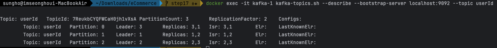
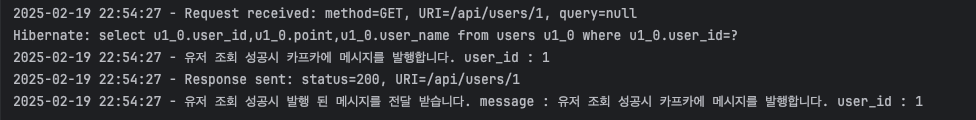
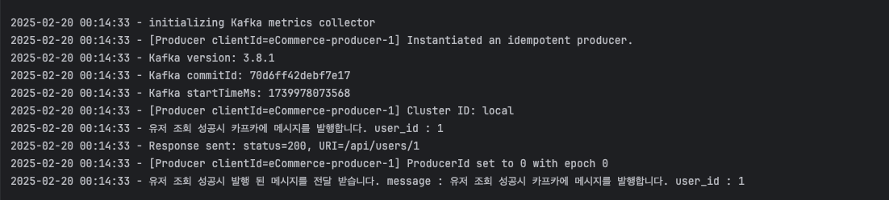

# 카프카 consumer, producer 연동 및 테스트

## 토픽 생성

- `userId` 토픽 생성

```Java

@Bean
public NewTopic userId() {
    return TopicBuilder.name(userId)
        .partitions(3)
        .replicas(2)
        .build();
}
```

### 결과



## Producer

- 유저 조회 성공시 유저 조회에 대한 메시지 생성

```Java
    // 유저 정보 조회
public User getUserByUserId(Long userId) {
    User user = userRepository.findById(userId)
        .orElseThrow(() -> new ResourceNotFoundException(ExceptionMessage.USER_NOT_FOUND));
    eventPublisher.publishString("userId",
        "유저 조회 성공시 카프카에 메시지를 발행합니다. user_id : " + user.getUserId().toString());

    log.info("유저 조회 성공시 카프카에 메시지를 발행합니다. user_id : {}", user.getUserId().toString());
    return user;
}
```

## Consumer

- 발급된 메시지를 전달 받는 Consumer

```Java

@KafkaListener(topics = "userId", groupId = "eCommerce", containerFactory = "kafkaListenerContainerFactory")
public void consumeRecord(ConsumerRecord<String, String> record) {
    String value = record.value();
    log.info("유저 조회 성공시 발행 된 메시지를 전달 받습니다. message : {}", value);
}
```



### 오류1

```
2025-02-19 22:53:30 - [Consumer clientId=consumer-eCommerce-1, groupId=eCommerce] User provided listener org.springframework.kafka.listener.KafkaMessageListenerContainer$ListenerConsumer$ListenerConsumerRebalanceListener failed on invocation of onPartitionsAssigned for partitions [userId-0, userId-1, userId-2]
org.apache.kafka.common.errors.TimeoutException: Timeout of 60000ms expired before the position for partition userId-0 could be determined
2025-02-19 22:53:30 - Consumer exception
java.lang.IllegalStateException: This error handler cannot process 'org.apache.kafka.common.errors.TimeoutException's; no record information is available
	at org.springframework.kafka.listener.DefaultErrorHandler.handleOtherException(DefaultErrorHandler.java:198)
	at org.springframework.kafka.listener.KafkaMessageListenerContainer$ListenerConsumer.handleConsumerException(KafkaMessageListenerContainer.java:1985)
	at org.springframework.kafka.listener.KafkaMessageListenerContainer$ListenerConsumer.run(KafkaMessageListenerContainer.java:1380)
	at java.base/java.util.concurrent.CompletableFuture$AsyncRun.run(CompletableFuture.java:1804)
	at java.base/java.lang.Thread.run(Thread.java:842)
Caused by: org.apache.kafka.common.errors.TimeoutException: Timeout of 60000ms expired before the position for partition userId-0 could be determined
2025-02-19 22:53:30 - [Consumer clientId=consumer-eCommerce-1, groupId=eCommerce] Notifying assignor about the new Assignment(partitions=[userId-0, userId-1, userId-2])
2025-02-19 22:53:30 - [Consumer clientId=consumer-eCommerce-1, groupId=eCommerce] Adding newly assigned partitions: 
2025-02-19 22:53:30 - eCommerce: partitions assigned: []
```

- 최초 실행시 위의 오류가 발생되는 문제가 있음...

### 오류2

- 1번오류 발생후 스프링을 종료 -> 재 실행할 경우 아래와 같은 오류 발생..

```
2025-02-19 22:57:33 - 유저 조회 성공시 카프카에 메시지를 발행합니다. user_id : 1
2025-02-19 22:57:33 - [Producer clientId=eCommerce-producer-1] Got error produce response with correlation id 6 on topic-partition userId-1, retrying (2147483646 attempts left). Error: NOT_LEADER_OR_FOLLOWER
2025-02-19 22:57:33 - [Producer clientId=eCommerce-producer-1] Received invalid metadata error in produce request on partition userId-1 due to org.apache.kafka.common.errors.NotLeaderOrFollowerException: For requests intended only for the leader, this error indicates that the broker is not the current leader. For requests intended for any replica, this error indicates that the broker is not a replica of the topic partition. Going to request metadata update now
2025-02-19 22:57:33 - Response sent: status=200, URI=/api/users/1
2025-02-19 22:57:33 - [Producer clientId=eCommerce-producer-1] Got error produce response with correlation id 8 on topic-partition userId-1, retrying (2147483645 attempts left). Error: NOT_LEADER_OR_FOLLOWER
2025-02-19 22:57:33 - [Producer clientId=eCommerce-producer-1] Received invalid metadata error in produce request on partition userId-1 due to org.apache.kafka.common.errors.NotLeaderOrFollowerException: For requests intended only for the leader, this error indicates that the broker is not the current leader. For requests intended for any replica, this error indicates that the broker is not a replica of the topic partition. Going to request metadata update now
2025-02-19 22:57:33 - [Producer clientId=eCommerce-producer-1] Got error produce response with correlation id 10 on topic-partition userId-1, retrying (2147483644 attempts left). Error: NOT_LEADER_OR_FOLLOWER
2025-02-19 22:57:33 - [Producer clientId=eCommerce-producer-1] Received invalid metadata error in produce request on partition userId-1 due to org.apache.kafka.common.errors.NotLeaderOrFollowerException: For requests intended only for the leader, this error indicates that the broker is not the current leader. For requests intended for any replica, this error indicates that the broker is not a replica of the topic partition. Going to request metadata update now

```

=>
`docker exec -it kafka-1 kafka-topics.sh --delete --bootstrap-server localhost:9092 --topic userId`
토픽을 삭제하고 실행시 1번오류 => 2번오류 순으로 발생되는 문제가 있음...

### 오류 해결 방법

- 클러스터 구성이 잘못된 것인지... 단일 클러스터로 실행 후 명령어로 사전에 토픽을 추가하고 실행하면 오류 1번 발생하지 않음

```bash
 docker exec -it kafka-1 kafka-topics.sh --describe --bootstrap-server localhost:9092 --topic userId
```

