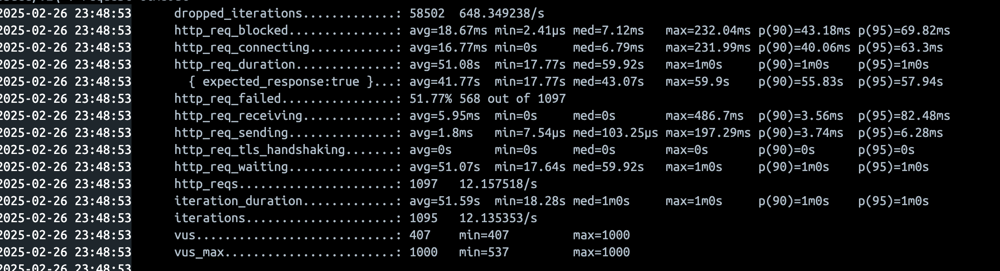
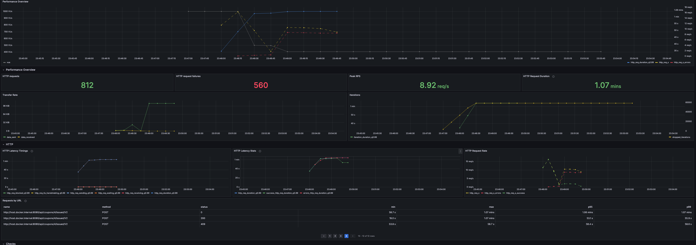
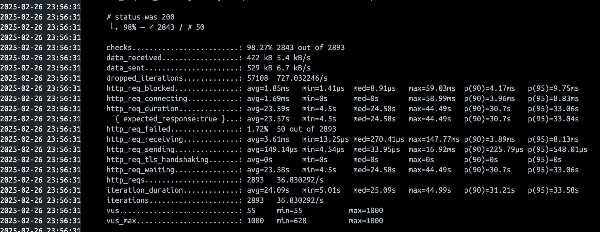
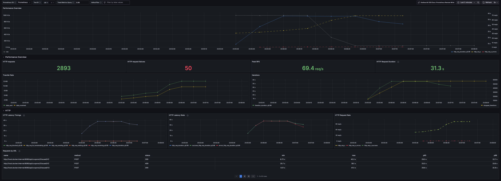
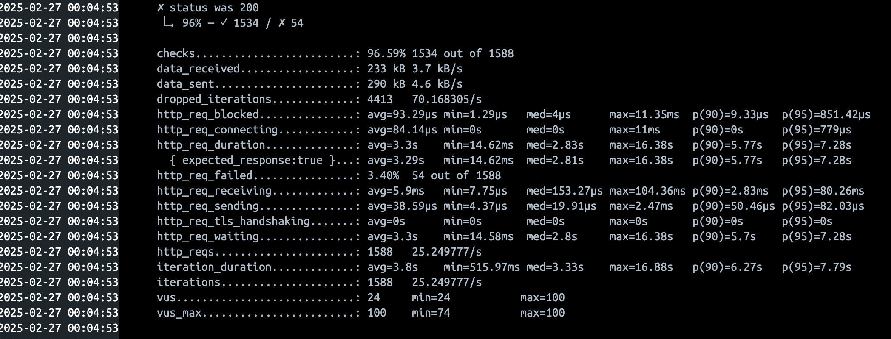
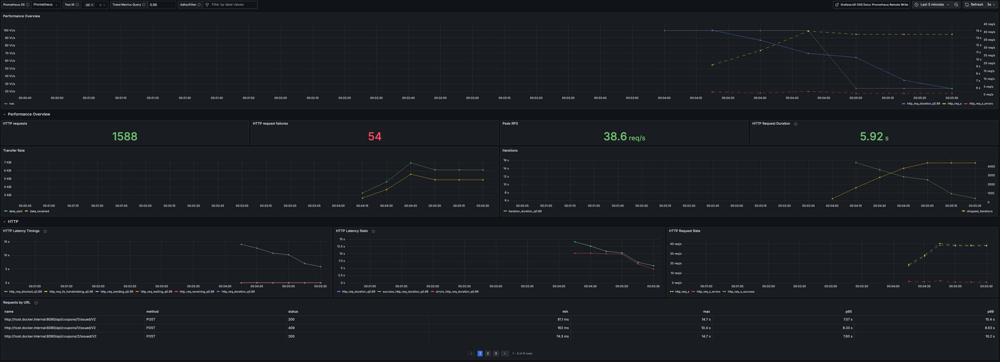
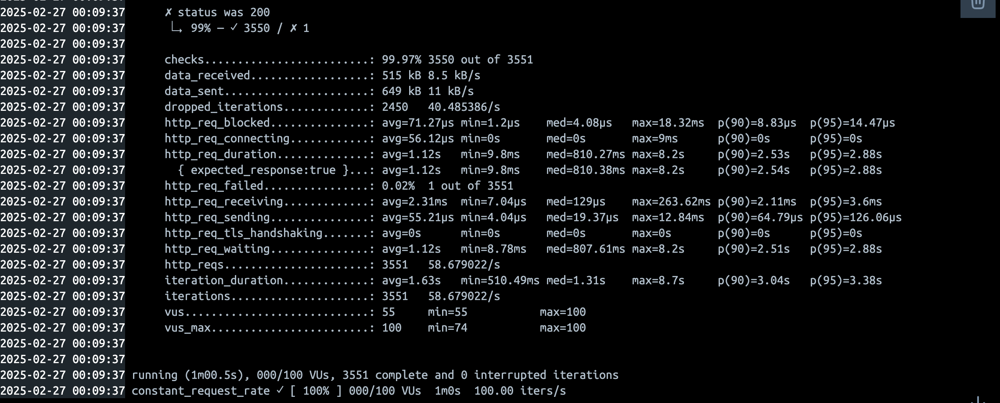
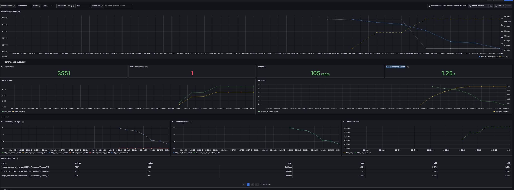
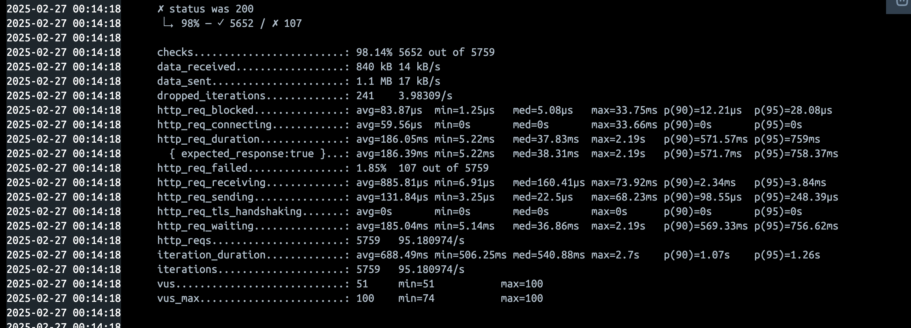
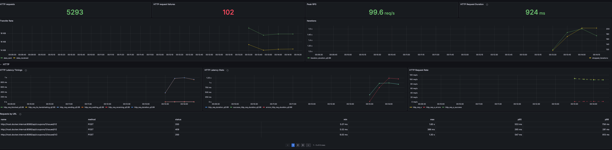

# 부하테스트

## 부하테스트 툴

### K6

- 오픈소스 성능 테스트 툴
- 선정이유
    - 설치 및 테스트가 쉽고? 간단
    - CLI를 이용하여 성능 테스트를 진행 가능
    - JS를 이용하여 테스트 시나리오를 작성

## 부하 테스트 대상 선정

- 이번 과제에 진행 할 부하 테스트 대상은 기존에 동시성 이슈를 많이 다뤘던 문제를 선정하여 진행

### 테스트 API

1. 쿠폰 발급

## 부하테스트 시나리오 설계

각 테스트의 시나리오를 작성하고 반복횟수를 설정하여 시나리오를 실행

### 사전 데이터 준비

1. RDS 데이터 셋팅

- docker의 docker-entrypoint-initdb.d 경로에 sql 파일을 넣어 초기 데이터 셋팅
    - sql 파일 실행시 macOS에서 읽기 권한 문제가 발생, docekr desktop에 전체 디스크 읽기 권한 부여 하여 해결
    - DDL 진행 및 테스트하기 위한 데이터 셋팅

2. Redis 쿠폰 셋팅

- Redis에 쿠폰 데이터 셋팅
    - redis-cli SET key value를 사용하여 쿠폰을 셋팅

## docker-compose 리소스 할당

- docker-compose.yml 파일에 리소스 할당을 위한 설정을 추가
- yaml 파일에 리소스 제한을 할당하여 최소는 낮게 잡고 최대는 리소스를 계산하여 사용

```yaml
    deploy:
      resources:
        limits:
          cpus: "0.5"
          memory: "1.0G"
```

### 기본 리소스 할당 ( CPU / memory)

- mysql: 4.0 / 8.0G
- redis: 0.5 / 1.0G
- kafka: 0.5 / 1.0G
- kafka-ui: 0.5 / 1.0G
- grafana: 0.5 / 1.0G
- prometheus: 0.5 / 1.0G
- k6: 할당 x ( 무제한 )

### 테스트 데이터

- User: 50000명 셋팅
- Coupon: 4개 셋팅
- 각 쿠폰 수량 : 각 15000개 (redis)

### 테스트 옵션

- 초당 최대 요청 : 1000건
- 가상의 사용자 : 500명
- 최대 사용자 : 1000명
- 테스트 시간 : 1분

## 결과 분석 ( spring-app )

### 0.5 / 1.0G




- 초당 8건의 요청을 처리

### 1.0 / 2.0G




- 초당 69건의 요청을 처리

## 테스트 옵션 변경

- 초당 최대 요청 : 100건
- 가상의 사용자 : 50명
- 최대 사용자 : 100명
- 테스트 시간 : 1분

### 변경된 결과 분석

### 0.5 / 1.0G




- 초당 38건의 요청을 처리

### 1.0 / 2.0G




- 초당 105건의 요청을 처리
- 평균 1초의 응답속도로 지금까지 가장 준수 한 속도를 보임

### 제한 설정 하지 않음




- 초당 99.6건의 요청을 처리

# 결론

- 컴퓨터 부하를 주는 K6와 받아드리는 Spring 등 여러 서버의 리소스 들이 하나의 컴퓨터에서 제한된(적은)  리소스를 할당 받아 실행 되어 최대 리소스를 제한 한다고
  하더라도 적절한 성능을 발휘하기 힘든 환경이라고 생각됨
- 0.5 / 1.0G => 1.0 / 2.0G로 리소스를 두배로 늘렸을 때 성능이 두배로 증가하는 것이 아니라 실제 결과는 더 높은 향상을 보임으로 너무 낮은 리소스를 할당하는
  경우 데이터 처리가 느려질 수 있음